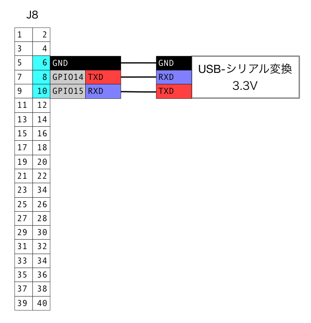

# USB-シリアルアダプタでコンソールに接続する

* 2017-11-29-raspbian-stretch-lite.img の初回起動
* HDMI+マウス+キーボードを使わずシリアル接続を使用
* Raspberry Pi W(他のRaspberry Piもほぼ同様)

## USB-シリアルブリッジインターフェイスを用意する

USB-UARTブリッジICには

* [FTDI FT-232系](http://www.ftdichip.com/Products/ICs/FT232R.htm)
* [Silicon Labs CP210系](https://jp.silabs.com/products/development-tools/software/usb-to-uart-bridge-vcp-drivers)
* [Profilic PL2303系](http://www.prolific.com.tw/US/ShowProduct.aspx?pcid=41&showlevel=0017-0037-0041)

などがあるので、ICに合わせたドライバをインストールしておく。

* 回路電圧は **3.3V** を使用すること。
* 買うならFT232系, CP210xを使用したものがおすすめ。FT232はニセモノチップも出回っているので注意。

以下のように接続する

## 初回の場合 config.txt を修正する

WiFi,BT内蔵のRaspberry Piで使うRaspbianは、
デフォルトでシリアルコンソールが無効になっているらしいので、
SDカードをMacに接続し、config.txt を編集します。

	$ vim /Volumes/boot/config.txt
	[追記]
	dtoverlay=pi3-miniuart-bt

## シリアル接続

Raspberry Piとは 115200/1-N-8 で接続
Raspberry piの電源を入れる前に接続しておく

screenをつかって接続

	$ screen /dev/cu.usbserial-ABCDEFG 115200

	CTRL+A k y で終了

cu をつかって接続

	$ sudo cu -l /dev/cu.usbserial-ABCDEFG -s 115200

ログインする

	Username: pi
	Password: raspberry

でログイン。piユーザはsudo でrootになれます。

電源を切る

	$ sudo poweroff

参考サイト

* [RaspberryPi3でシリアル通信を行う](https://qiita.com/yamamotomanabu/items/33b6cf0d450051d33d41)
* [THE RASPBERRY PI UARTS](https://www.raspberrypi.org/documentation/configuration/uart.md)

